# Jenkins CI/CD - Build et Push Docker image (GitHub -> Docker hub) + Deploy sur VM nommé Arbiter

## Objectif
Mettre en place un pipeline CI/CD simple :
- **Source** : GitHub (repo `MakhtoutMohamed/dvp_01`)
- **CI** : Jenkins (dans un conteneur Docker sur la VM Jenkins)
- **Build Docker + Push** : exécuté sur une **VM dédiée “arbiter”** (où Docker est installé)
- **CD (Deploy)** : remplacer automatiquement le conteneur en production sur **le même port** (`213`)

---
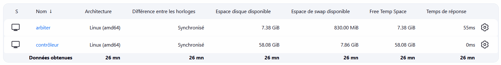
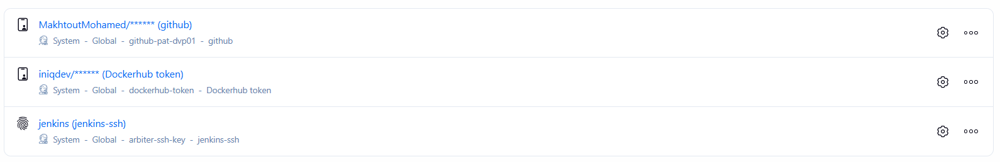
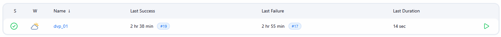
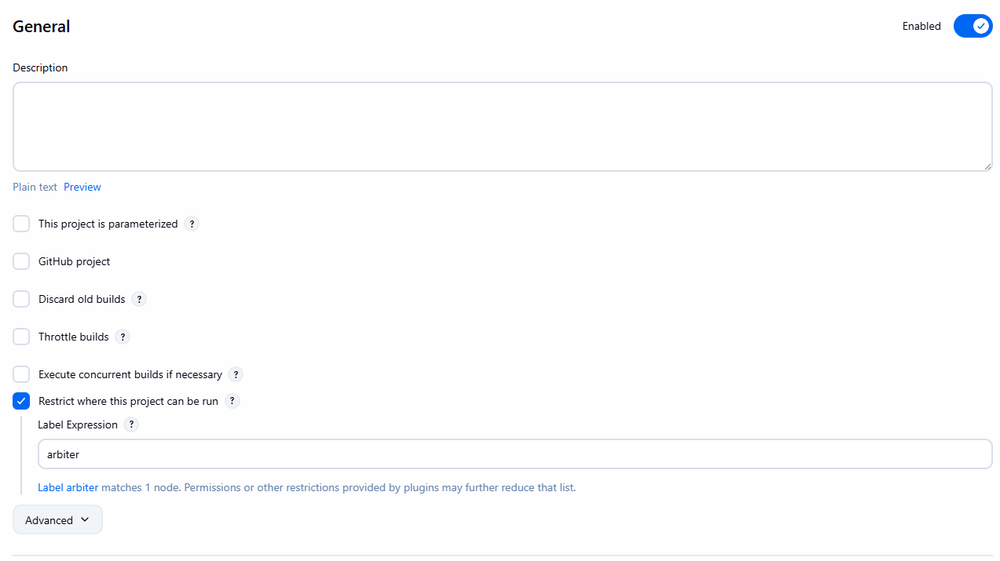
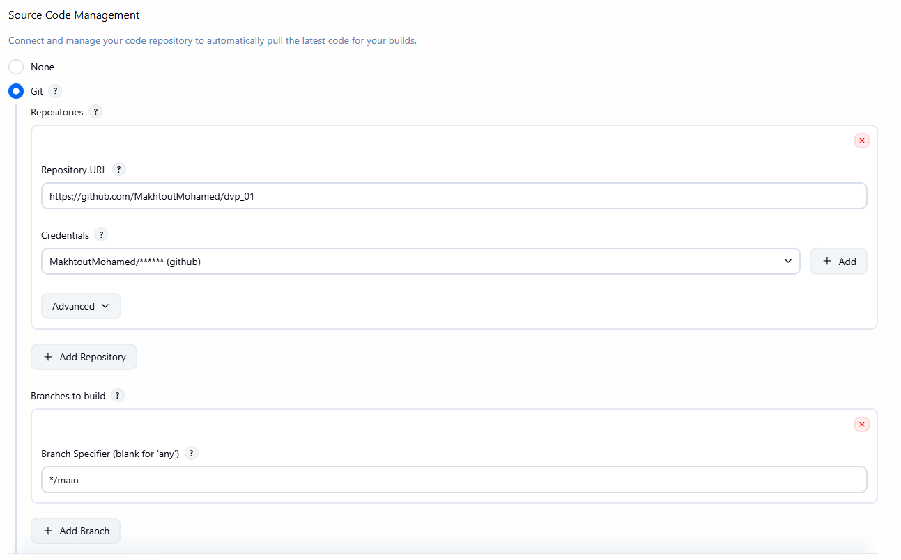
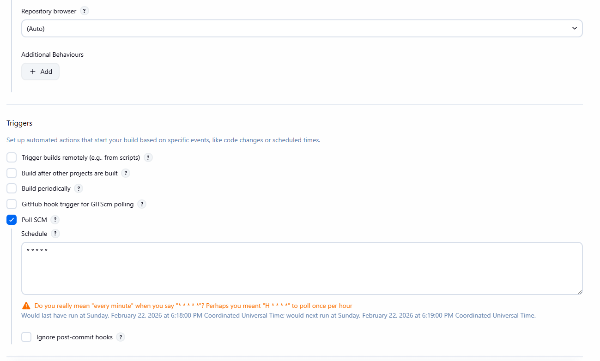
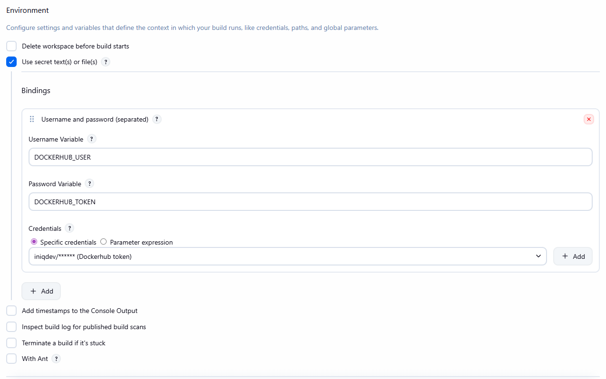
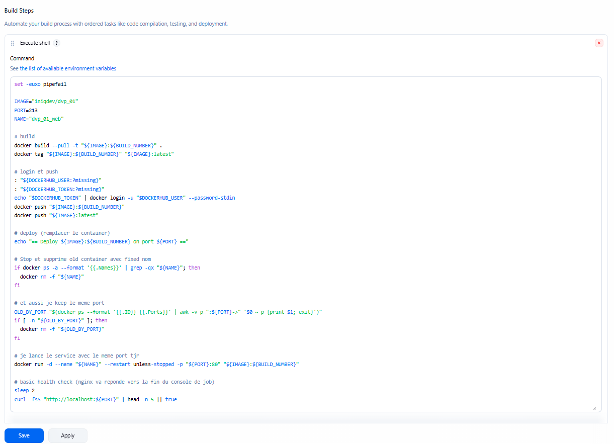
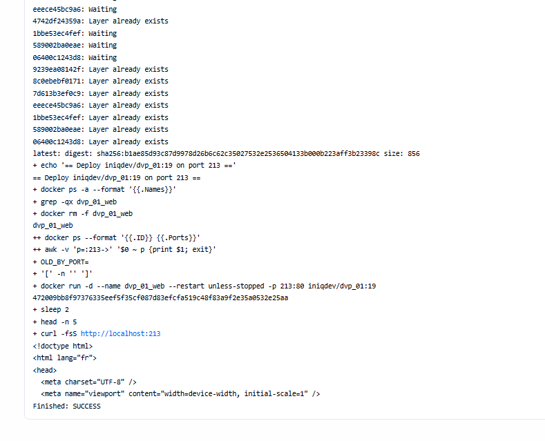
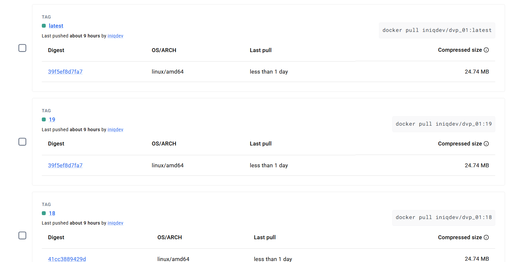
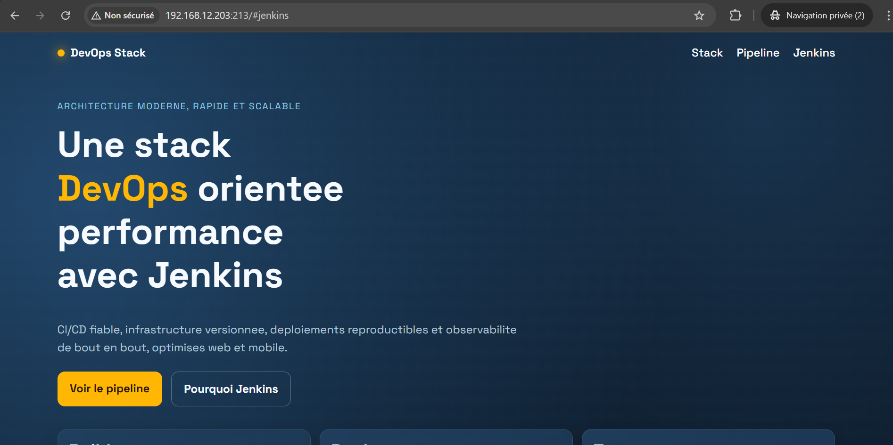
---

## Architecture
- **VM Jenkins** : `192.168.12.201`
  - Jenkins tourne en **Docker Compose**
- **VM Arbiter** : `192.168.12.203`
  - Docker installé
  - Jenkins Agent (node) exécutant les builds et déploiements

> Jenkins ne construit pas les images Docker dans son propre conteneur.  
> Les builds Docker sont déportés sur la VM Arbiter via un **agent Jenkins SSH**.

---

## Repo GitHub
Repo : `https://github.com/MakhtoutMohamed/dvp_01` (branche `main`)  
Contenu minimum :
- `Dockerfile`
- `index.html`
- `app.js`
- `styles.css`

---

## Docker Hub
Repo Docker Hub : `iniqdev/dvp_01`

---

## 1) Préparation VM Arbiter (Docker remote build host)
### 1.1 Activation Docker API TCP (2375)
> Port 2375 = non chiffré, à limiter au réseau privé / firewall

Ca: (systemd override pour ajouter `-H tcp://0.0.0.0:2375`) :
- création d'un override systemd
- redémarrage docker
- vérification :
  - `ss -lntp | grep 2375`
  - `curl http://localhost:2375/_ping`

### 1.2 Firewall
Ouverture du port `2375/tcp` (ou rule limitée à l'IP Jenkins).
- `firewall-cmd --list-ports`

---

## 2) Création user Jenkins sur Arbiter + SSH Key Auth
### 2.1 User + droits docker
- user : `jenkins`
- ajouté au groupe docker

### 2.2 Auth SSH par clé
- génération clé côté VM Jenkins : `~/.ssh/jenkins_agent`
- copie de la clé publique dans : `/home/jenkins/.ssh/authorized_keys`
- permissions :
  - `chmod 700 ~/.ssh`
  - `chmod 600 ~/.ssh/authorized_keys`

---

## 3) Jenkins Node (Agent) : Arbiter
Ajout d'un node Jenkins :
- Nom : `arbiter`
- Label : `arbiter`
- Remote root dir : `/home/jenkins/agent`
- Launch method : **Launch agents via SSH**
- Credentials : clé privée SSH (ID : `arbiter-ssh-key`)

---

## 4) Jenkins Job (Freestyle) : dvp_01
### 4.1 Gestion du code source (Git)
- Repo URL : `https://github.com/MakhtoutMohamed/dvp_01.git`
- Branche : `*/main`
- Credentials GitHub : `github-pat-dvp01`

### 4.2 Exécution sur node arbiter
- “Restrict where this project can be run” = `arbiter`

---

## 5) Credentials DockerHub dans Jenkins
Credential utilisé :
- ID : `dockerhub-token`
- Type : **Username with password**
  - Username : `iniqdev`
  - Password : Docker Hub Access Token

Binding dans le job :
- Username Variable : `DOCKERHUB_USER`
- Password Variable : `DOCKERHUB_TOKEN`

---

## 6) Pipeline shell : Build -> Push -> Deploy (port fixe 213)
### 6.1 Build & Push Docker image
- Build image : `iniqdev/dvp_01:${BUILD_NUMBER}`
- Tag `latest`
- Push vers DockerHub

### 6.2 Deploy (remplacement du conteneur)
Objectif :
- Le service tourne **toujours** sur `http://<arbiter-ip>:213`
- À chaque build, on remplace l'ancien conteneur par le nouveau

Script (Execute shell) :
- stop/remove conteneur existant
- relancer le nouveau avec `--restart unless-stopped`
- mapping `-p 213:80`

---

## 7) Résultats
- Chaque `git push` sur `main` déclenche Jenkins
- Jenkins exécute le job sur le node `arbiter`
- Image Docker build + push sur DockerHub (`iniqdev/dvp_01`)
- Déploiement automatique sur arbiter, port stable : `213`
